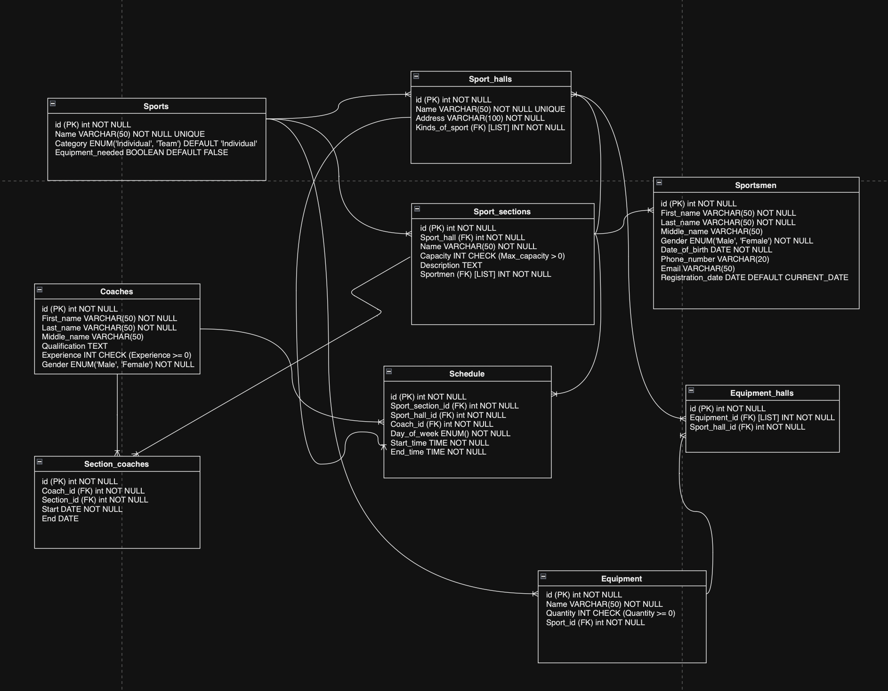

## Описание собственного варианта проекта в рамках лабораторной работы

Создать программную систему, предназначенную для администрации спортивной школы. Она должна
обеспечивать хранение сведений о каждом спортсмене, тренерском штабе, о секциях,
которые преподаются в рамках школы, и о залах. Для каждой секции необходимо учитывать оборудование, используемое для тренировок.

Об спортсменах должны храниться следующие сведения: ФИО, дата рождения, наименование секций, контактные данные, дата зачисления.
Администартор должен иметь возможность добавить сведения о новом спортсмене или
тренере, внести в базу данных информацию о тренировках, удалить данные об уволившемся тренере и отчисленном из школы спортсмене,
внести изменения в данные об тренерах и спортсменах, в том числе записать спортсмена на новую секцию.

Администратору могут потребоваться следующие сведения:
- Какая секция будет в заданном зале, в заданный день недели на заданное время?
- Сколько спортсменов занимаются в секции и какое количество свободных мест?
- Какое расписание тренировок у конкретного тренера?
- Какое оборудование имеется в наличии в определенном зале?
- Список доступных секций по конкретному виду спорта

Необходимо предусмотреть возможность получения документа,
представляющего собой отчет о полной информации конкретной секции. Отчет включает
сведения об секции, информацию о тренер, полный список спортсменов с их контактными данными, а также расписание тренировок.

Схема данных:
