## Реализация клиентской части приложения средствами vue.js.

Описание проекта: система предназначена для администрирования спортивного комплекса (под спортивным комплексом подразумевается, например, спортивная школа). Она обеспечивает учет данных о секциях, тренерах, учениках и расписании тренировок. Спортивный комплекс включает в себя залы для разных видов спорта.

В ней представлены следующие интерфейсы
1. Регистрация и авторизация для администраторов
   - Форма для вода данных

2. Главная страница. 
   - Расписание тренировок на сегодняшний день во всех залах
   - Новостная лента

3. Навигационная панель
   - Вкладки: расписание, ученики, тренеры, отчет, секции

4. Ученики. 
   - Список все учеников (ФИО, пол, дата рождения, контактные данные, дата регистрации)
   - Добавление учеников
   - Редактирование учеников

5. Тренеры. 
   - Список всех тренеров (персональная информация) 
   - Возможность добавлять новых тренеров в базу.

6. Расписание. 
   - Актуальная информация о занятости спортзалов по дням недели
   - Фильтрация по тренеру

7. Секции.
   - Список всех секций
   - Добавление ученика в конкретную секцию

8. Отчет по тренерам
   - Формирование отчета про конкретного тренера

Приступим к реализации варианта проекта. Для начала создадим и настроим сервер, а именно проработаем модели, сериализаторы, представления и маршруты. Ниже на скриншотах будут представлены частичные куски кода:

models.py
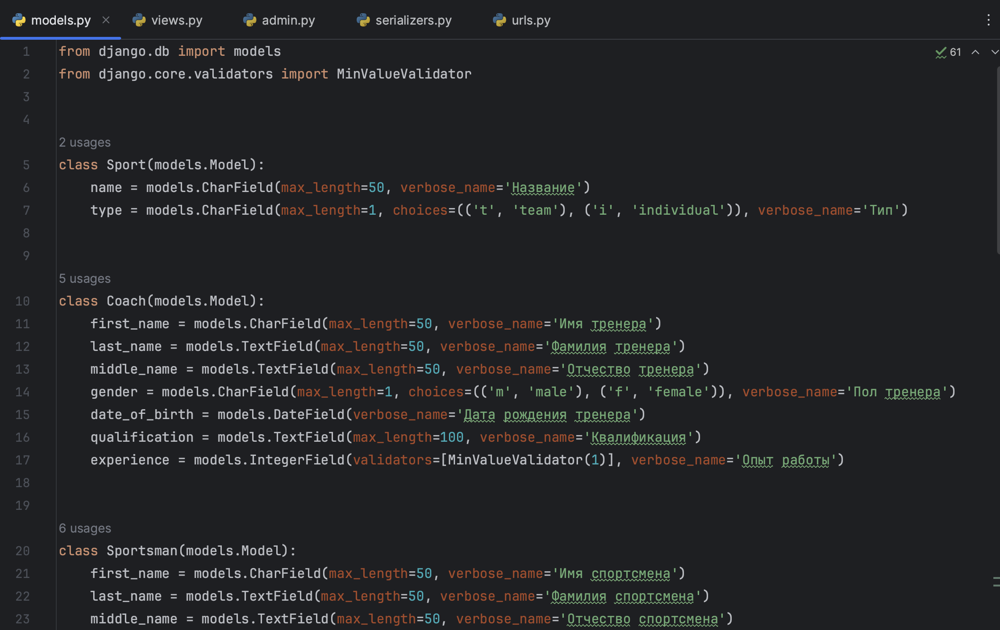

views.py
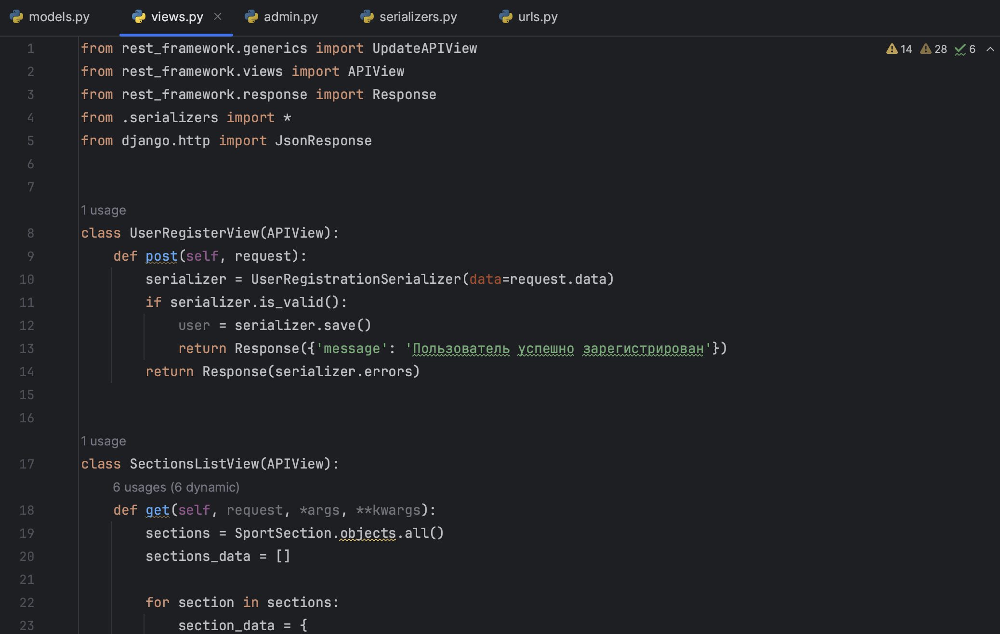

admin.py
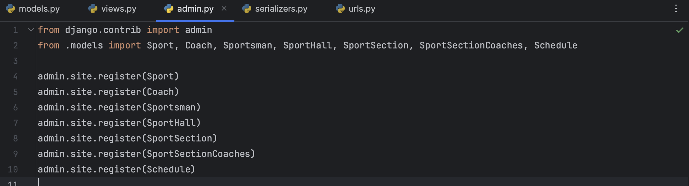

serializers.py
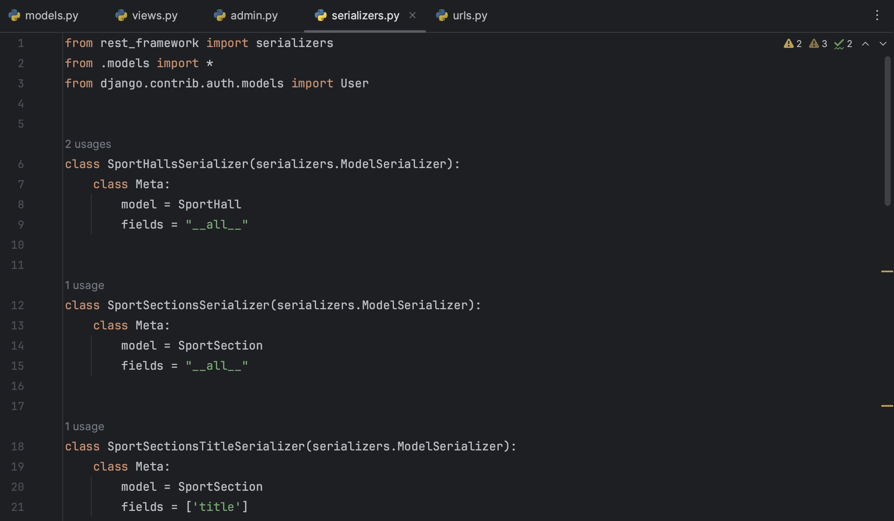

urls.py
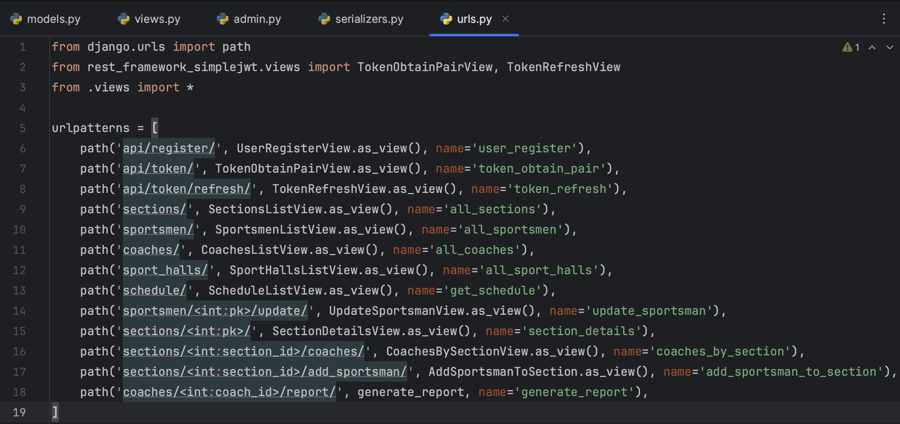

Сразу настроим CORS в нашем проекте:
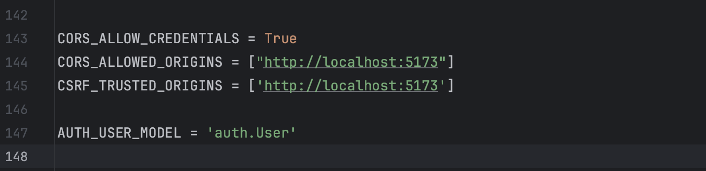

Далее рассмотрим решистрацию и логин. Они реализуются через токен, которые генерируется нашим сервером.
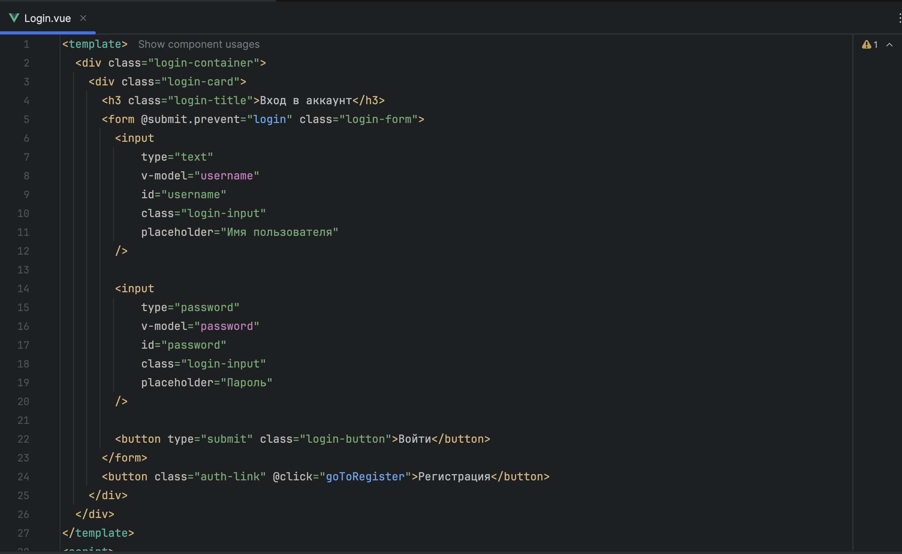
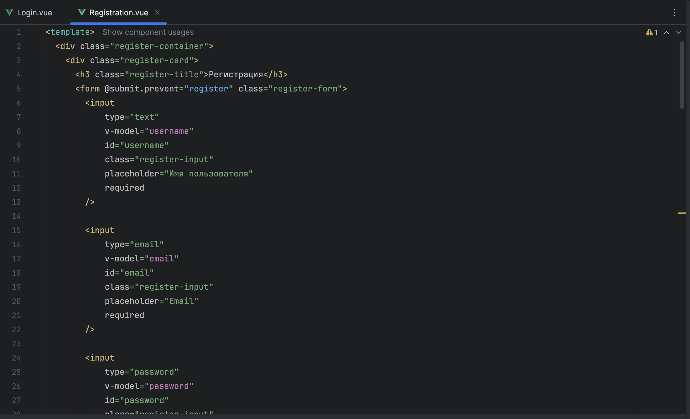

Перейдем к главной странице, вот что получилось:
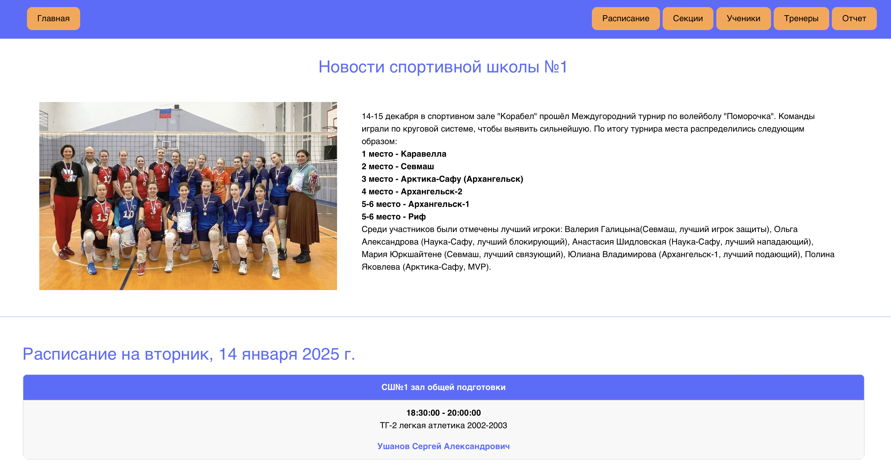
Для этого я создала скрипт, которы на основе всех тренировок в бд применял фильтрацию по сегодняшнему дню недели:
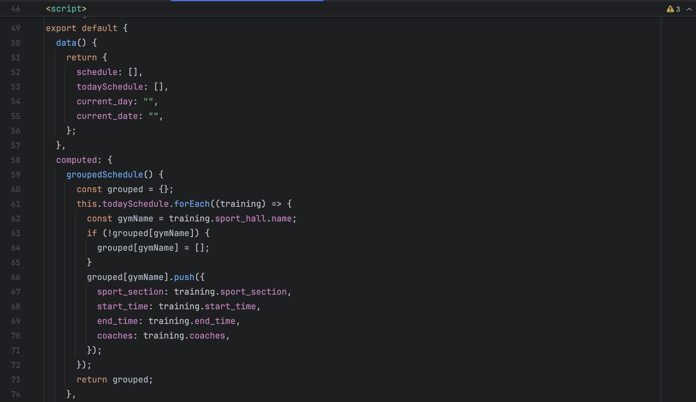

Страница "Расписание". Реализавана фильтрация по конкретному тренеру СШ:
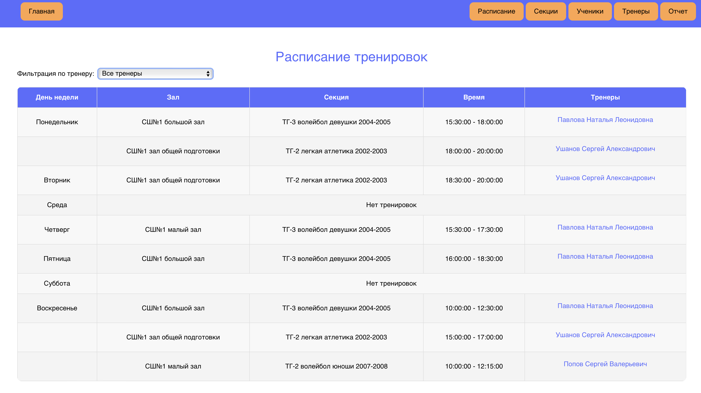
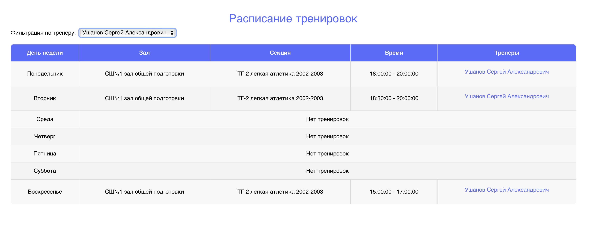

Страница "Секции":
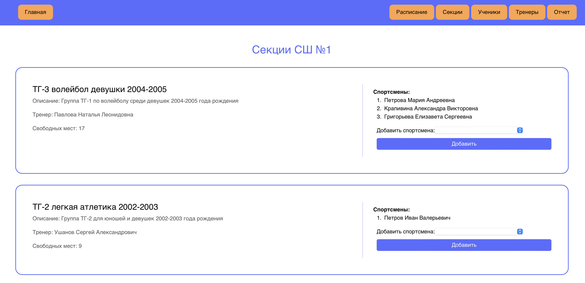

Страница "Ученики", а именно спортсмены спортивной школы. Есть опция редактирования спортсмена и доабвления новых:
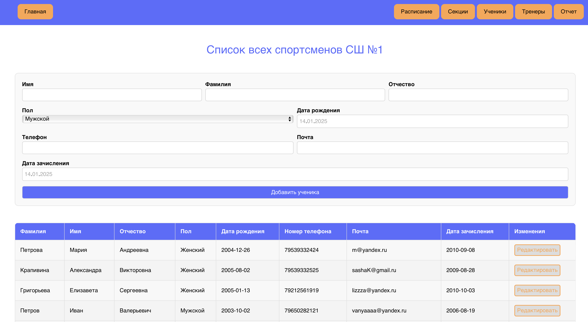

Страница "Тренеры". Опци добавления нового тренера:
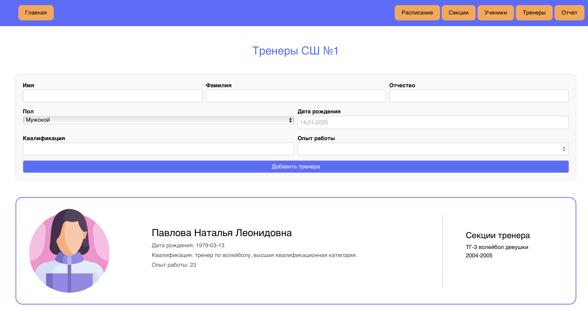

Страница "Отчеты". Она отвечает за генерацию отчетов про конкретного тренера:
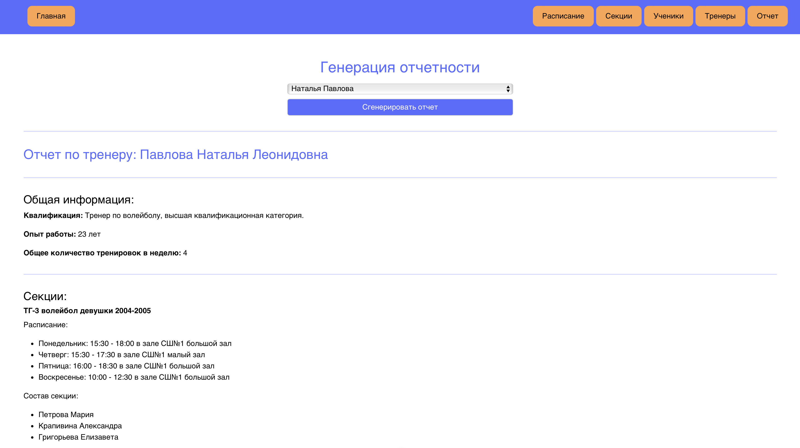

Вывод: Таким образом, в рамках данной лабораторной работы я смогла совместить все полученные знания в рамках дисциплины "Фронтенд-разработка" и "WEB-разработка", в конечном итоге получив готовый проект