## Практическая работа №4.2. "Введение во Vue.js"
Цель работы: получить представление о работе Vue.js.

Первым делом установим необходимые расширения:
```
pip install npm
pip install node
npm install -g @vue/cli
```

Теперь, когда vue и vue-cli глобально установлены, можно приступать к инициализации проекта. Выполним команду
```
npm init vue@latest
```
Следуем шагам, которые предлагает CLI-утилита:
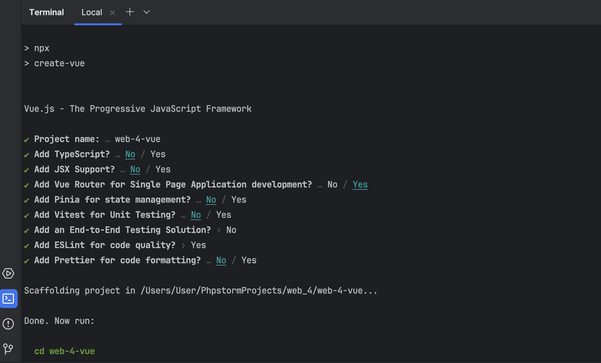

На последок выполним команды, которые нам предлагает утилита:
```
cd web-4-vue
npm install
npm run dev
```

Готово, все равботает:
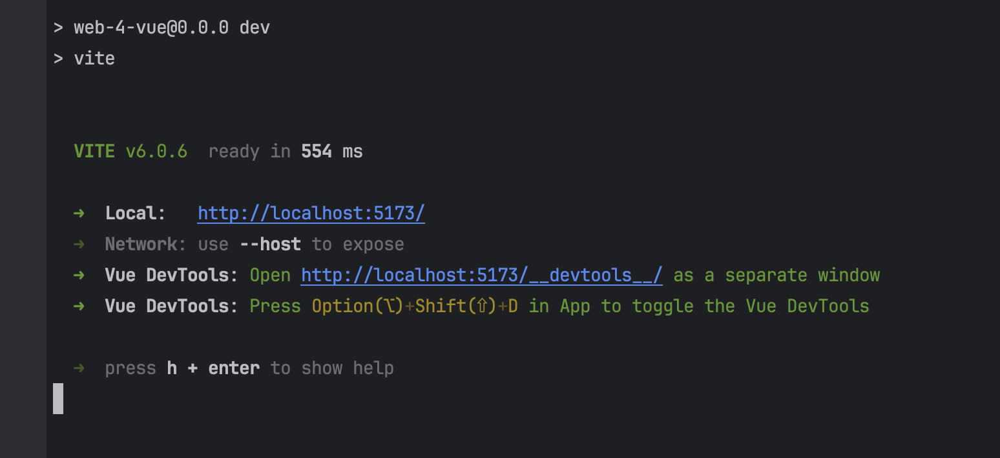
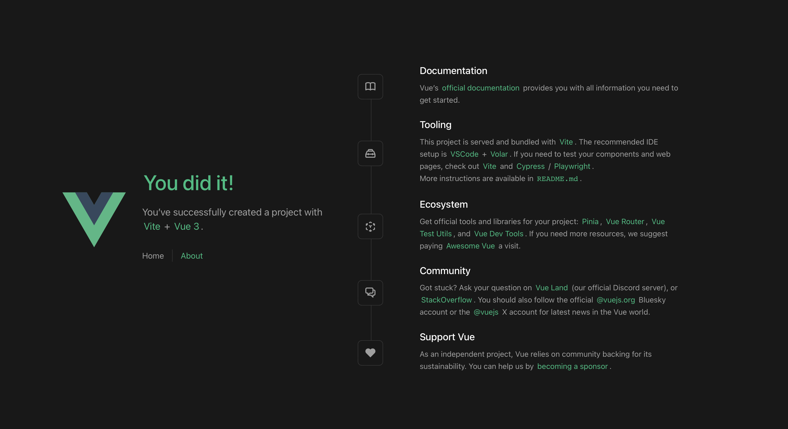


Теперь поработаем с роутингом. Создадим файл с наполнением, который будет нашей страницей:
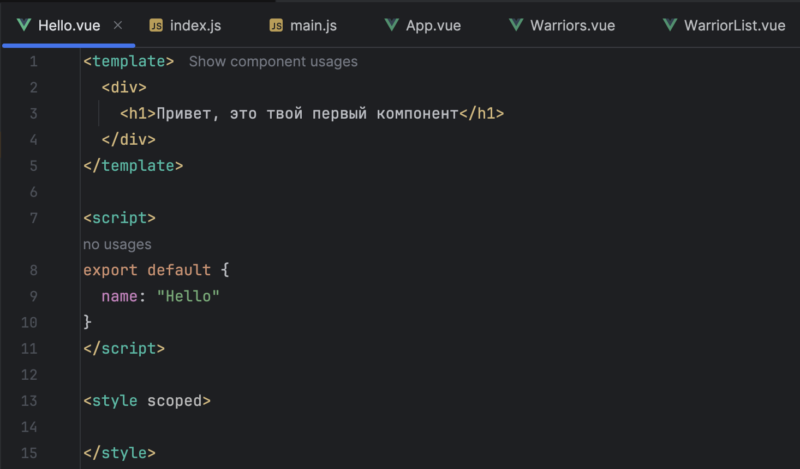

И после настройки роутера получаем следующий результат:
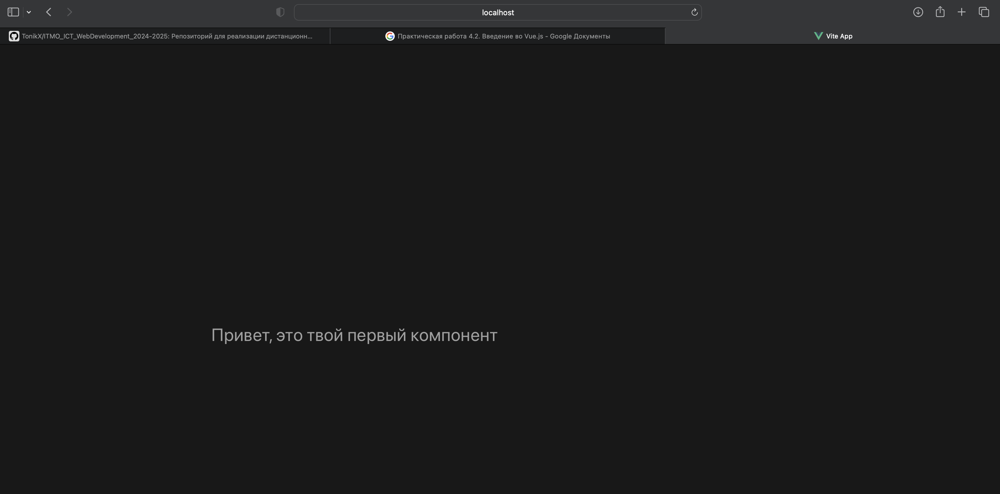

А теперь приступим к проработке ранее созданных моделей Войнов. Напишем код представления для Warriors:
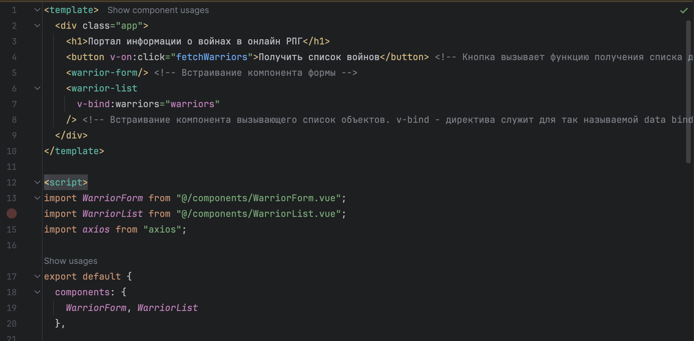
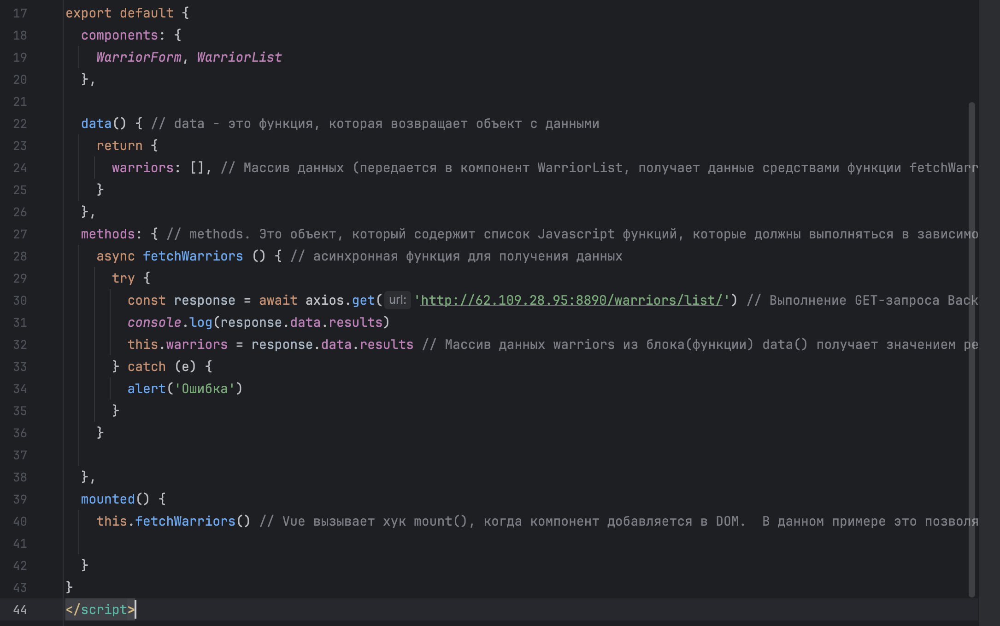

Далее напишем код компоненты получения данных:
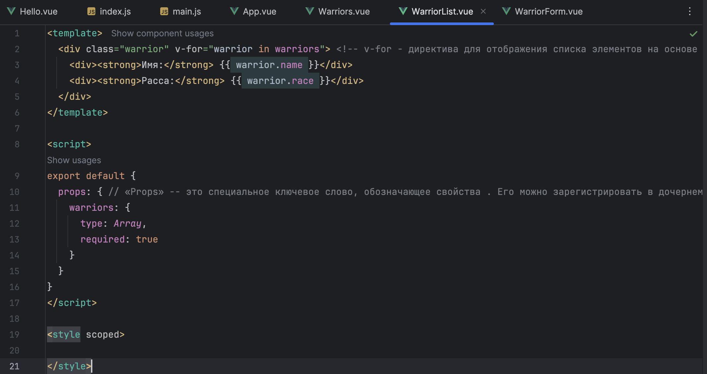

И код создания формы компоненты получения данных:
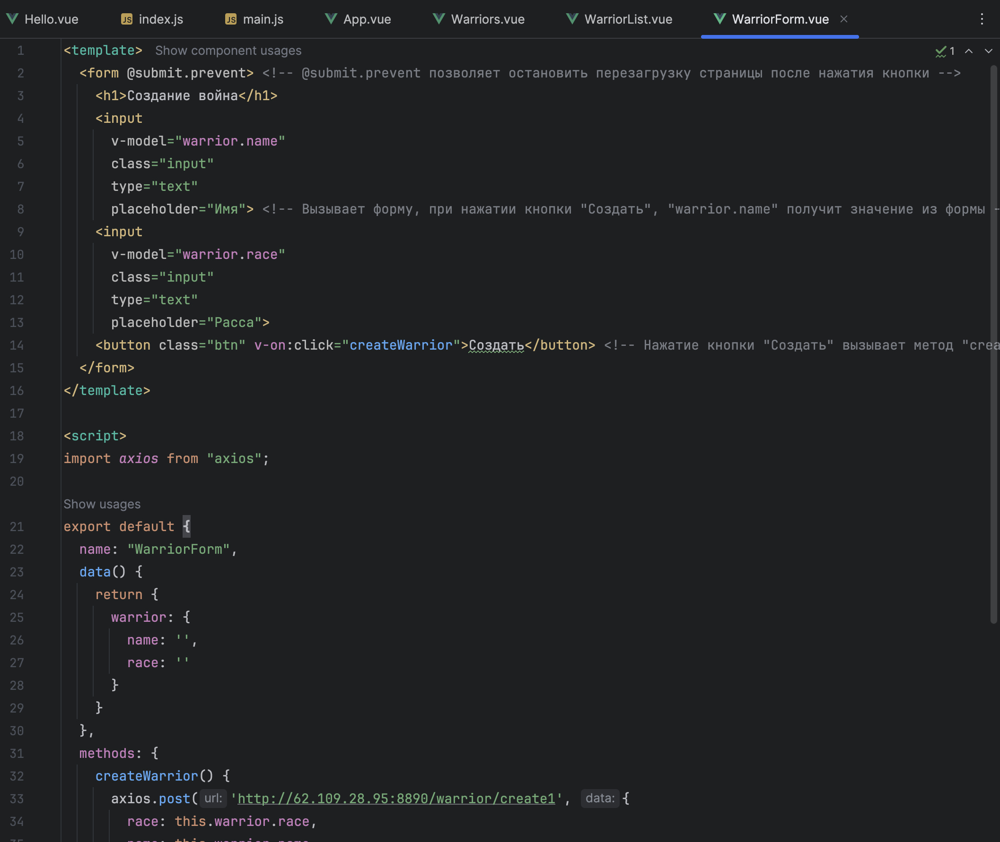

Перед проверкой внесем коррективы в роутер:
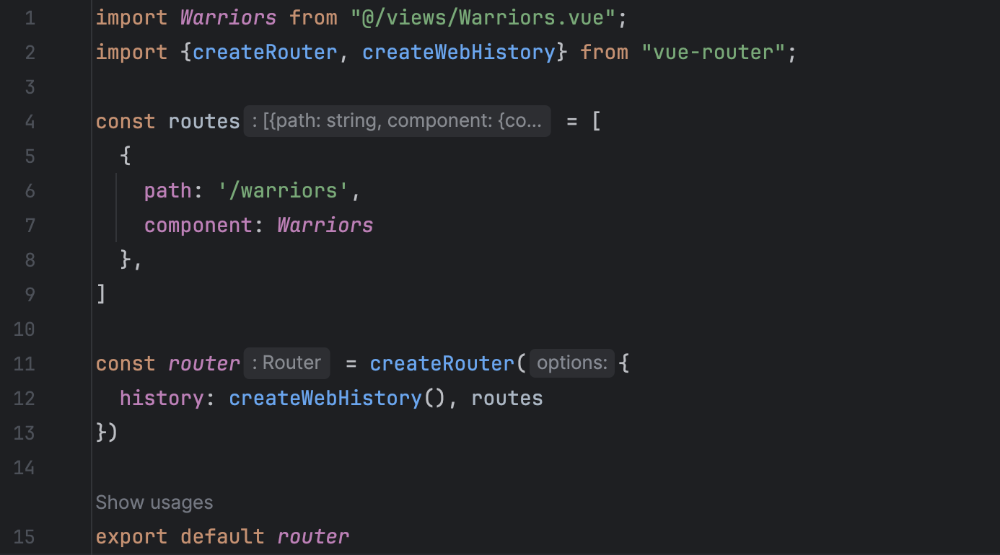

Переходим по ссылке и получаем следующий результат:
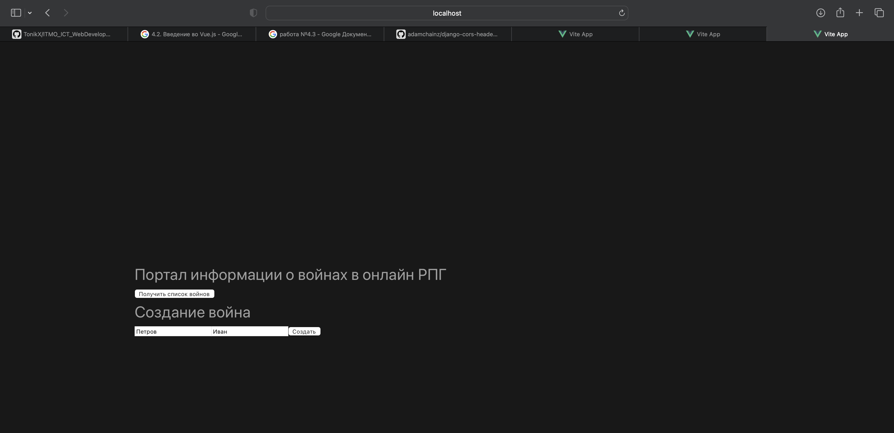
        
В рамках данной практической работы я познакомилась и освежила свои знания о Vue