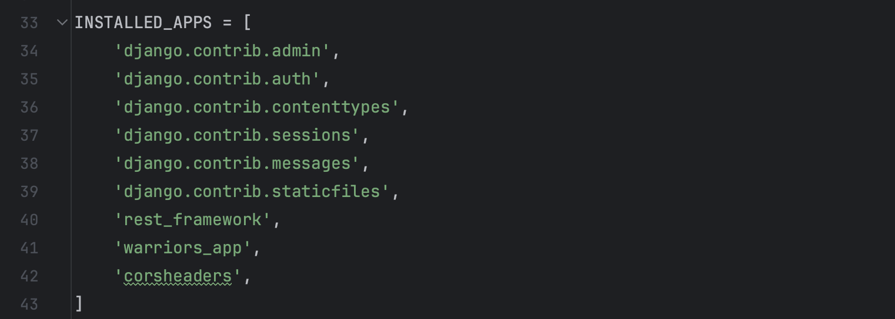
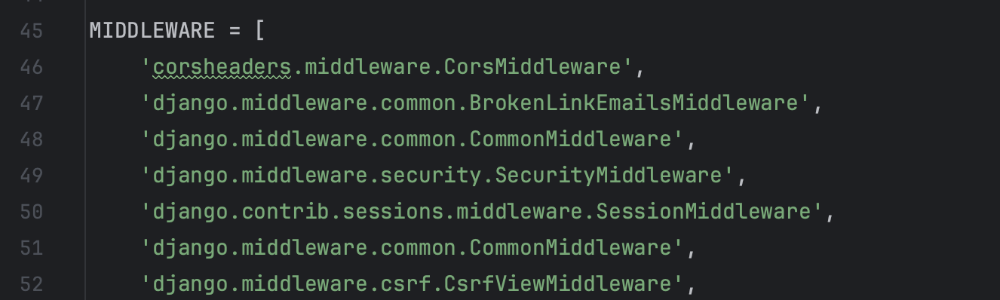
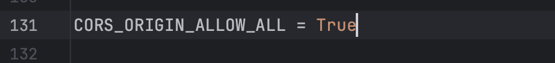

## Практическая работа №4.3. "Настройка CORS (Cross-origin resource sharing)"
Цель работы: получить практические навыки настройки CORS (Cross-origin resource sharing)

Первым делом необходимо установить django-cors-headers с помощью pip:
```
pip install django-cors-headers
```

После этого добавим его в свой settings.py файл проекта :


И затем пропишем corsheaders.middleware.CorsMiddleware в “MIDDLEWARE_CLASSES” в том же файле:


Подключим CORS:


Таким образом, мне удалось выполнить задание и подключить CORS в свой проект